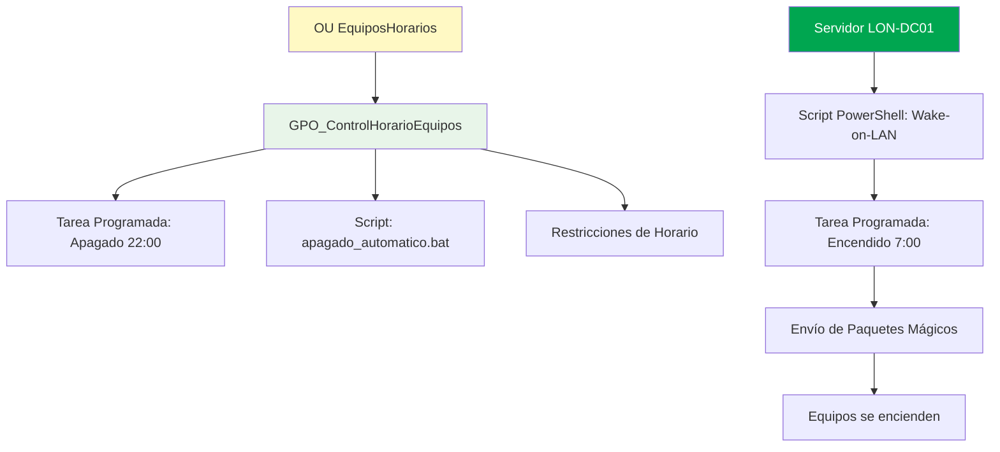

# Control Horario de Equipos

## ⏰ Sistema de Control Horario Automático

El sistema de control horario permite gestionar automáticamente el encendido y apagado de los equipos del dominio, optimizando el consumo energético y estableciendo horarios de trabajo definidos.

---

## 🎯 Objetivos

- 🕐 Apagar automáticamente los equipos a las **22:00 horas**
- 🌅 Encender automáticamente los equipos a las **7:00 horas**
- ⏱️ Restringir el acceso fuera del horario laboral
- 💾 Notificar a los usuarios antes del apagado para guardar su trabajo
- 🔋 Reducir el consumo energético del club

---

## 🏗️ Arquitectura del Sistema



---

## 📋 Configuración Paso a Paso

### Paso 1: Crear OU para Equipos con Control Horario

1. Abrir **Usuarios y equipos de Active Directory**
2. Clic derecho en `betis.local` → **Nuevo** → **Unidad organizativa**
3. Nombre: `EquiposHorarios`
4. Aceptar

### Paso 2: Mover Equipos a la OU

1. Localizar los objetos de equipo en **Computers**
2. Seleccionar los equipos que necesitan control horario
3. Clic derecho → **Mover**
4. Seleccionar **EquiposHorarios**

### Paso 3: Crear GPO de Control Horario

1. Abrir **Administración de directivas de grupo**
2. Clic derecho en **EquiposHorarios** → **Crear una GPO en este dominio y vincularla aquí**
3. Nombre: `GPO_ControlHorarioEquipos`
4. Clic derecho → **Editar**

---

## 🌙 Apagado Automático

### Script de Apagado

Crear el archivo `C:\Scripts\apagado_automatico.bat` en el servidor:

```batch
@echo off
REM Script de apagado automático a las 22:00
REM Proyecto Windows Server 2022 - Real Betis Balompié

echo ========================================
echo   APAGADO AUTOMÁTICO PROGRAMADO
echo   Real Betis Balompié
echo ========================================
echo.
echo El equipo se apagará en 60 segundos.
echo Por favor, guarde su trabajo.
echo.

REM Apagar el equipo en 60 segundos con mensaje
shutdown /s /f /t 60 /c "El equipo se apagará en 1 minuto. Guarde su trabajo."

REM Opciones del comando shutdown:
REM /s = Apagar el equipo
REM /f = Forzar el cierre de aplicaciones
REM /t 60 = Tiempo de espera de 60 segundos
REM /c = Mensaje a mostrar al usuario
```

### Compartir Carpeta de Scripts

1. Crear carpeta `C:\Scripts` en el servidor
2. Clic derecho → **Propiedades** → **Compartir**
3. Compartir como `Scripts`
4. Permisos: **Usuarios del dominio** → Lectura

### Configurar Tarea Programada mediante GPO

En la GPO `GPO_ControlHorarioEquipos`:

1. Navegar a: **Configuración del equipo** → **Preferencias** → **Configuración del Panel de control** → **Tareas programadas**
2. Clic derecho → **Nuevo** → **Tarea programada (Windows Vista y posterior)**
3. Configurar:

**Pestaña General:**
- **Acción:** Crear
- **Nombre:** Apagado Automático 22:00
- **Descripción:** Apaga el equipo automáticamente a las 22:00 horas
- **Ejecutar con los privilegios más altos:** ✅

**Pestaña Desencadenadores:**
- Clic en **Nuevo**
- **Iniciar la tarea:** Según una programación
- **Configuración:** Diariamente
- **Hora:** 22:00:00
- **Habilitado:** ✅

**Pestaña Acciones:**
- Clic en **Nueva**
- **Acción:** Iniciar un programa
- **Programa/script:** `\\LON-DC01\Scripts\apagado_automatico.bat`

**Pestaña Condiciones:**
- Desmarcar: "Iniciar la tarea solo si el equipo está conectado a la corriente alterna"

**Pestaña Configuración:**
- ✅ Permitir que la tarea se ejecute a petición
- ✅ Ejecutar la tarea lo antes posible después de un inicio programado perdido

---

## 🌅 Encendido Automático (Wake-on-LAN)

### Requisitos Previos

!!! warning "Requisitos Hardware"
    - Tarjeta de red compatible con Wake-on-LAN
    - Wake-on-LAN habilitado en la BIOS
    - Equipo conectado a la corriente eléctrica
    - Conocer las direcciones MAC de los equipos

### Obtener Direcciones MAC

En cada equipo cliente, ejecutar:

```powershell
Get-NetAdapter | Select-Object Name, MacAddress
```

O desde el servidor, para equipos del dominio:

```powershell
Get-ADComputer -Filter * -SearchBase "OU=EquiposHorarios,DC=betis,DC=local" | ForEach-Object {
    $computerName = $_.Name
    Write-Host "Equipo: $computerName"
}
```

### Script PowerShell de Wake-on-LAN

Crear el archivo `C:\Scripts\wake_on_lan.ps1`:

```powershell
<#
.SYNOPSIS
    Script Wake-on-LAN para encender equipos automáticamente
.DESCRIPTION
    Envía paquetes mágicos a las direcciones MAC especificadas
    para encender los equipos a las 7:00 AM
.NOTES
    Proyecto Windows Server 2022 - Real Betis Balompié
#>

# Direcciones MAC de los equipos a encender
$MacAddresses = @(
    "00-11-22-33-44-55",  # Equipo Portería 1
    "AA-BB-CC-DD-EE-FF",  # Equipo Portería 2
    "11-22-33-44-55-66",  # Equipo Administración 1
    "66-77-88-99-AA-BB"   # Equipo Administración 2
)

Write-Host "========================================" -ForegroundColor Green
Write-Host "  WAKE-ON-LAN - Real Betis Balompié" -ForegroundColor Green
Write-Host "========================================" -ForegroundColor Green
Write-Host ""

foreach ($Mac in $MacAddresses) {
    try {
        Write-Host "Enviando paquete mágico a: $Mac" -ForegroundColor Yellow
        
        # Convertir dirección MAC a array de bytes
        $MacByteArray = $Mac -split "[:-]" | ForEach-Object { [Byte] "0x$_"}
        
        # Crear paquete mágico (6 bytes FF + 16 repeticiones de la MAC)
        $MagicPacket = (,0xFF * 6) + ($MacByteArray * 16)
        
        # Enviar paquete UDP por broadcast
        $UdpClient = New-Object System.Net.Sockets.UdpClient
        $UdpClient.Connect(([System.Net.IPAddress]::Broadcast),7)
        $UdpClient.Send($MagicPacket,$MagicPacket.Length) | Out-Null
        $UdpClient.Close()
        
        Write-Host "✓ Paquete enviado correctamente a $Mac" -ForegroundColor Green
    }
    catch {
        Write-Host "✗ Error al enviar paquete a $Mac : $_" -ForegroundColor Red
    }
}

Write-Host ""
Write-Host "Proceso completado." -ForegroundColor Green
Write-Host "Los equipos deberían encenderse en unos segundos." -ForegroundColor Cyan
```

### Programar Ejecución del Script

En el servidor LON-DC01, crear una tarea programada:

1. Abrir **Programador de tareas**
2. **Crear tarea básica**
3. Nombre: `Wake-on-LAN Equipos Betis`
4. Desencadenador: **Diariamente** a las **7:00**
5. Acción: **Iniciar un programa**
6. Programa: `powershell.exe`
7. Argumentos: `-ExecutionPolicy Bypass -File "C:\Scripts\wake_on_lan.ps1"`
8. Finalizar

---

## 🔐 Restricciones de Horario de Inicio de Sesión

### Configurar Horarios por Usuario

1. Abrir **Usuarios y equipos de Active Directory**
2. Seleccionar usuario → Clic derecho → **Propiedades**
3. Pestaña **Cuenta**
4. Clic en **Horas de inicio de sesión**
5. Configurar horario permitido: **Lunes a Viernes, 7:00 - 22:00**
6. Denegar acceso fuera de este horario

### Configurar mediante PowerShell

```powershell
# Establecer horario de inicio de sesión para un usuario
$username = "avalles"
$logonHours = New-Object byte[] 21
# Configurar bytes para permitir acceso L-V 7:00-22:00
# (Requiere cálculo específico de bits)

Set-ADUser -Identity $username -Replace @{logonHours=$logonHours}
```

---

## ✅ Aplicar y Verificar Configuración

### Forzar Actualización de GPO

En los equipos cliente:

```powershell
gpupdate /force
```

### Verificar Directivas Aplicadas

```powershell
gpresult /r
```

### Ver Tareas Programadas

```powershell
Get-ScheduledTask | Where-Object {$_.TaskName -like "*Apagado*"}
```

---

## 🧪 Pruebas del Sistema

### Probar Apagado Automático

1. Cambiar temporalmente la hora de la tarea a 5 minutos en el futuro
2. Esperar a que se ejecute la tarea
3. Verificar que aparece el mensaje de advertencia
4. Verificar que el equipo se apaga después de 60 segundos

### Probar Wake-on-LAN

1. Apagar manualmente un equipo de prueba
2. Ejecutar el script de Wake-on-LAN desde el servidor:
   ```powershell
   C:\Scripts\wake_on_lan.ps1
   ```
3. Verificar que el equipo se enciende automáticamente

### Probar Restricciones de Horario

1. Intentar iniciar sesión fuera del horario permitido
2. Verificar que se muestra mensaje de restricción horaria

---

## 📊 Monitoreo y Logs

### Ver Logs de Tareas Programadas

En el servidor:

```powershell
Get-WinEvent -LogName "Microsoft-Windows-TaskScheduler/Operational" | 
    Where-Object {$_.Message -like "*Apagado*"} | 
    Select-Object TimeCreated, Message -First 10
```

### Ver Eventos de Apagado

```powershell
Get-EventLog -LogName System -Source "User32" -Newest 20 | 
    Where-Object {$_.EventID -eq 1074}
```

---

## 🔧 Solución de Problemas

### Problema: El equipo no se apaga automáticamente

**Soluciones:**

1. Verificar que la GPO está aplicada:
   ```powershell
   gpresult /r
   ```

2. Verificar que la tarea programada existe:
   ```powershell
   Get-ScheduledTask -TaskName "Apagado Automático 22:00"
   ```

3. Ejecutar manualmente la tarea:
   ```powershell
   Start-ScheduledTask -TaskName "Apagado Automático 22:00"
   ```

### Problema: Wake-on-LAN no funciona

**Soluciones:**

1. Verificar que Wake-on-LAN está habilitado en la BIOS
2. Verificar configuración de la tarjeta de red:
   ```powershell
   Get-NetAdapter | Get-NetAdapterPowerManagement
   ```
3. Habilitar Wake-on-LAN:
   ```powershell
   Get-NetAdapter | Set-NetAdapterPowerManagement -WakeOnMagicPacket Enabled
   ```

### Problema: Usuarios no pueden iniciar sesión en horario permitido

**Soluciones:**

1. Verificar configuración de horas de inicio de sesión del usuario
2. Sincronizar hora del servidor y clientes:
   ```powershell
   w32tm /resync
   ```

---

## 📈 Beneficios del Sistema

| Beneficio | Descripción |
|-----------|-------------|
| 💰 **Ahorro Energético** | Reducción del consumo eléctrico fuera del horario laboral |
| 🔒 **Seguridad** | Control de acceso basado en horarios |
| ⚙️ **Automatización** | Gestión centralizada sin intervención manual |
| 📊 **Auditoría** | Registro de eventos de encendido/apagado |
| 🌱 **Sostenibilidad** | Contribución a la responsabilidad ambiental del club |

---

!!! success "Resultado Esperado"
    Los equipos de la OU EquiposHorarios se apagarán automáticamente a las 22:00 y se encenderán a las 7:00, con notificaciones previas a los usuarios y restricciones de acceso fuera del horario laboral.

!!! tip "Recomendación"
    Configura excepciones para equipos críticos que necesiten estar disponibles 24/7, como servidores o sistemas de seguridad.
