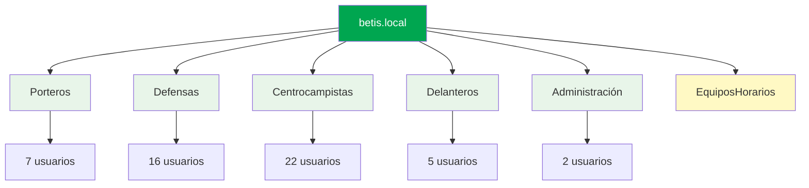

# Estructura del Dominio

## 🏗️ Organización del Dominio

El dominio `betis.local` está organizado en **5 Unidades Organizativas (OUs)** principales que representan los diferentes departamentos del club.

---

## 📋 Unidades Organizativas

### 🥅 OU Porteros

**Descripción:** Jugadores que ocupan la posición de portero

**Usuarios (7):**

| Nombre | Nombre de inicio de sesión |
|--------|---------------------------|
| Álvaro Valles | avalles |
| Pau López | plopez |
| Adrián | adrian |
| Fran Vieites | fvieites |
| Germán García | ggarcia |
| Guilherme Fernandes | gfernandes |
| Manu González | mgonzalez |

---

### 🛡️ OU Defensas

**Descripción:** Jugadores de la línea defensiva

**Usuarios (16):**

| Nombre | Nombre de inicio de sesión |
|--------|---------------------------|
| Héctor Bellerín | hbellerin |
| Diego Llorente | dllorente |
| Natan | natan |
| Marc Bartra | mbartra |
| Ricardo Rodríguez | rrodriguez |
| Romain Perraud | rperraud |
| Víctor Gómez | vgomez |
| Júnior Firpo | jfirpo |
| Youssouf Sabaly | ysabaly |
| Nobel Mendy | nmendy |
| Félix Garreta | fgarreta |
| Ángel Ortiz | aortiz |
| Pablo Busto | pbusto |
| Lucas Alcázar | lalcazar |
| Rodrigo Kohon | rkohon |
| Sergio Arribas | sarribas |

---

### ⚽ OU Centrocampistas

**Descripción:** Jugadores del centro del campo

**Usuarios (22):**

| Nombre | Nombre de inicio de sesión |
|--------|---------------------------|
| Sofyan Amrabat | samrabat |
| João Cardoso | jcardoso |
| Sergi Altimira | saltimira |
| Antony | antony |
| Pablo Fornals | pfornals |
| Chimy Ávila | cavila |
| Anass Ezzalzouli | aezzalzouli |
| William Carvalho | wcarvalho |
| Iker Losada | ilosada |
| Rodrigo Riquelme | rriquelme |
| Nelson Deossa | ndeossa |
| Giovani Lo Celso | glocelso |
| Marc Roca | mroca |
| Iván Corralejo | icorralejo |
| Isco | isco |
| Aitor Ruibal | aruibal |
| Mawuli Mensah | mmensah |
| Carlos Guirao | cguirao |
| Jesús Rodríguez | jrodriguez |
| Dani Pérez | dperez |
| Mateo Flores | mflores |
| Carlos Reina | creina |

---

### 🎯 OU Delanteros

**Descripción:** Jugadores de ataque

**Usuarios (5):**

| Nombre | Nombre de inicio de sesión |
|--------|---------------------------|
| Cédric Bakambu | cbakambu |
| José Morante | jmorante |
| Cristian Hernández | chernandez |
| Marcos Fernández | mfernandez |
| Pablo García | pgarcia |

---

### 👔 OU Administración

**Descripción:** Personal administrativo y técnico

**Usuarios (2):**

| Nombre | Nombre de inicio de sesión |
|--------|---------------------------|
| Manuel Pellegrini | mpellegrini |
| Juan Sevillano | jsevillano |

---

### ⏰ OU EquiposHorarios

**Descripción:** Unidad organizativa especial para equipos que requieren control horario automático

**Función:** Contiene los objetos de equipo (computadoras) que tienen configurado:
- Apagado automático a las 22:00
- Encendido automático a las 7:00 (Wake-on-LAN)
- Restricciones de horario de inicio de sesión

---

## 📊 Estadísticas del Dominio

| Métrica | Valor |
|---------|-------|
| **Total de OUs** | 6 |
| **Total de Usuarios** | 52 |
| **Porteros** | 7 (13.5%) |
| **Defensas** | 16 (30.8%) |
| **Centrocampistas** | 22 (42.3%) |
| **Delanteros** | 5 (9.6%) |
| **Administración** | 2 (3.8%) |

---

## 🔐 Configuración de Usuarios

### Contraseña Inicial

Todos los usuarios se crean con la siguiente configuración:

- **Contraseña inicial:** `Betis2024!`
- ✅ El usuario debe cambiar la contraseña en el siguiente inicio de sesión
- ✅ La contraseña nunca expira (configurable según política)

### Convención de Nombres

Los nombres de inicio de sesión siguen el patrón:

- **Primera letra del nombre + apellido completo** (en minúsculas)
- Ejemplos: `avalles`, `hbellerin`, `mpellegrini`

---

## 🔄 Perfiles de Usuario

### Perfiles Móviles

**Aplicado a:** Usuarios de la OU Porteros

- **Ubicación:** `\\LON-DC01\PerfMovil\%username%`
- **Ventaja:** Los usuarios pueden iniciar sesión desde cualquier equipo y mantener su configuración

### Perfiles Fijos

**Aplicado a:** Usuarios de la OU Defensas

- **Ubicación:** `\\LON-DC01\PerfFijo\[username]`
- **Ventaja:** Configuración consistente y controlada por el administrador

---

!!! tip "Buena Práctica"
    Mantén una nomenclatura consistente para los nombres de usuario y organiza las OUs de manera lógica según la estructura organizacional del club.

!!! warning "Importante"
    Asegúrate de que todos los usuarios cambien su contraseña inicial en el primer inicio de sesión para mejorar la seguridad del dominio.
