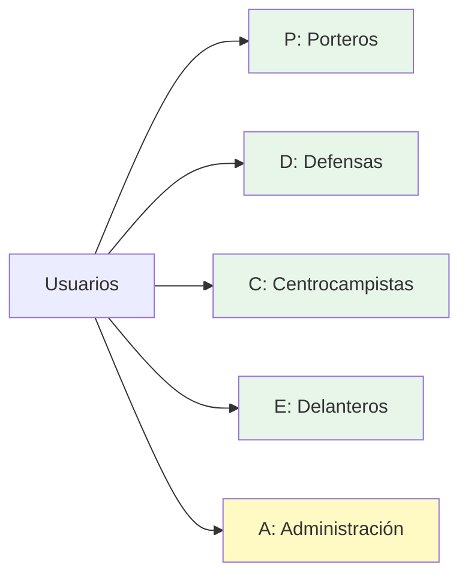

# Recursos Compartidos

## 📁 Carpetas Compartidas por OU

Cada Unidad Organizativa tiene su propia carpeta compartida con acceso restringido exclusivamente a los miembros de esa OU.

### Configuración de Carpetas

| OU              | Ruta de Red                    | Letra de Unidad | Permisos                |
| --------------- | ------------------------------ | --------------- | ----------------------- |
| Porteros        | `\\LON-DC01\Porteros`        | P:              | Solo OU Porteros        |
| Defensas        | `\\LON-DC01\Defensas`        | D:              | Solo OU Defensas        |
| Centrocampistas | `\\LON-DC01\Centrocampistas` | C:              | Solo OU Centrocampistas |
| Delanteros      | `\\LON-DC01\Delanteros`      | E:              | Solo OU Delanteros      |
| Administración | `\\LON-DC01\Administracion`  | A:              | Solo OU Administración |

---

## 🔧 Proceso de Configuración

### Paso 1: Crear Carpetas en el Servidor

En el servidor LON-DC01, crear las siguientes carpetas:

```
C:\Compartidas\
├── Porteros\
├── Defensas\
├── Centrocampistas\
├── Delanteros\
└── Administracion\
```

### Paso 2: Compartir Carpetas

Para cada carpeta (ejemplo: **Porteros**):

1. Clic derecho → **Propiedades** → **Compartir** → **Uso compartido avanzado**
2. ✅ Compartir esta carpeta
3. **Nombre del recurso compartido:** `Porteros`
4. **Permisos de compartición:**
   - Quitar grupo **Todos**
   - Agregar OU **Porteros**
   - Permisos: **Control total**

### Paso 3: Configurar Permisos NTFS

1. Pestaña **Seguridad** → **Editar**
2. Quitar grupo **Usuarios**
3. **Agregar** → Seleccionar OU correspondiente
4. Permisos NTFS:
   - ✅ Modificar
   - ✅ Leer y ejecutar
   - ✅ Mostrar el contenido de la carpeta
   - ✅ Leer
   - ✅ Escribir

!!! warning "Importante"
    Los permisos NTFS son más restrictivos que los permisos de compartición. Siempre se aplica el permiso más restrictivo.

---

## 🗺️ Mapeo Automático de Unidades de Red

Las unidades de red se mapean automáticamente mediante GPO cuando los usuarios inician sesión.

### Configuración mediante GPO

Para cada OU (ejemplo: **Porteros**):

1. Editar la GPO correspondiente (`GPO_Porteros`)
2. Navegar a: **Configuración de usuario** → **Preferencias** → **Configuración de Windows** → **Asignaciones de unidad**
3. Clic derecho → **Nuevo** → **Unidad asignada**
4. Configurar:
   - **Acción:** Crear
   - **Ubicación:** `\\LON-DC01\Porteros`
   - **Reconectar:** ✅
   - **Etiqueta como:** Carpeta Porteros
   - **Letra de unidad:** P:
   - **Mostrar esta unidad:** ✅

### Letras de Unidad Asignadas



---

## 🖨️ Impresoras Compartidas

Cada departamento tiene acceso exclusivo a su propia impresora compartida.

### Impresoras Configuradas

| Impresora | Nombre Compartido | OU con Acceso |
|-----------|-------------------|---------------|
| Impresora Porteros | `ImpPorteros` | Porteros |
| Impresora Defensas | `ImpDefensas` | Defensas |
| Impresora Centrocampistas | `ImpCentrocampistas` | Centrocampistas |
| Impresora Delanteros | `ImpDelanteros` | Delanteros |
| Impresora Administración | `ImpAdministracion` | Administración |

---

## 🔧 Configuración de Impresoras

### Paso 1: Instalar Impresora en el Servidor

1. Abrir **Panel de control** → **Dispositivos e impresoras**
2. Clic en **Agregar una impresora**
3. Seleccionar **Agregar una impresora local**
4. Puerto: **FILE: (Imprimir a archivo)** o crear puerto TCP/IP
5. Fabricante: **Generic** → Modelo: **Generic / Text Only**
6. Nombre: `Impresora_Porteros` (ejemplo)
7. Completar instalación

### Paso 2: Compartir Impresora

1. Clic derecho en la impresora → **Propiedades de impresora**
2. Pestaña **Compartir**
3. ✅ Compartir esta impresora
4. Nombre del recurso compartido: `ImpPorteros`

### Paso 3: Configurar Permisos

1. Pestaña **Seguridad**
2. **Quitar** el grupo **Todos**
3. **Agregar** → Buscar la OU correspondiente (ej: **Porteros**)
4. Permisos:
   - ✅ Imprimir
   - ✅ Administrar esta impresora (opcional, solo para administradores)

!!! tip "Consejo"
    Para facilitar la gestión, puedes crear grupos de seguridad específicos para cada departamento y asignar permisos a esos grupos.

---

## 📊 Perfiles de Usuario

### Perfiles Móviles

**Ubicación:** `\\LON-DC01\PerfMovil\%username%`

**Aplicado a:** Usuarios de Porteros

**Características:**
- ✅ Sincronización automática entre equipos
- ✅ Configuración personalizada se mantiene
- ✅ Archivos del escritorio disponibles en cualquier equipo
- ⚠️ Requiere más espacio en el servidor
- ⚠️ Tiempo de inicio de sesión más largo

**Configuración:**

1. Abrir **Usuarios y equipos de Active Directory**
2. Seleccionar usuario → Clic derecho → **Propiedades**
3. Pestaña **Perfil**
4. **Ruta de acceso al perfil:** `\\LON-DC01\PerfMovil\%username%`
5. Aplicar y Aceptar

---

### Perfiles Fijos

**Ubicación:** `\\LON-DC01\PerfFijo\[username]`

**Aplicado a:** Usuarios de Defensas

**Características:**
- ✅ Configuración consistente y controlada
- ✅ Menor uso de ancho de banda
- ✅ Inicio de sesión más rápido
- ⚠️ Cambios no se sincronizan entre equipos
- ⚠️ Requiere configuración manual por usuario

**Configuración:**

1. Crear carpeta manualmente en el servidor: `C:\Perfiles\Fijos\hbellerin`
2. Seleccionar usuario → Propiedades → Pestaña **Perfil**
3. **Ruta de acceso al perfil:** `\\LON-DC01\PerfFijo\hbellerin`
4. Aplicar y Aceptar

---

## 🔐 Carpetas de Perfiles

### Crear Carpetas para Perfiles

En el servidor, crear las carpetas:

```
C:\Perfiles\
├── Moviles\
└── Fijos\
```

### Compartir Carpetas de Perfiles

**Para Perfiles Móviles:**

1. Compartir `C:\Perfiles\Moviles` como `PerfMovil`
2. Permisos de compartición:
   - **Usuarios del dominio:** Control total
3. Permisos NTFS:
   - **Usuarios del dominio:** Control total

**Para Perfiles Fijos:**

1. Compartir `C:\Perfiles\Fijos` como `PerfFijo`
2. Permisos de compartición:
   - **Usuarios del dominio:** Control total
3. Permisos NTFS:
   - **Usuarios del dominio:** Control total

---

## ✅ Verificación de Acceso

### Probar Acceso a Carpetas Compartidas

1. Iniciar sesión con un usuario de Porteros
2. Abrir **Explorador de archivos**
3. Verificar que aparece la unidad **P:** (Carpeta Porteros)
4. Crear un archivo de prueba en P:
5. Intentar acceder a `\\LON-DC01\Defensas` (debe denegar acceso)

### Probar Impresoras

1. Abrir **Panel de control** → **Dispositivos e impresoras**
2. Verificar que aparece la impresora del departamento
3. Intentar imprimir una página de prueba
4. Verificar que no aparecen impresoras de otros departamentos

### Probar Perfiles

**Perfiles Móviles:**

1. Iniciar sesión con usuario de perfil móvil
2. Crear archivos en el escritorio
3. Cambiar configuración del sistema
4. Cerrar sesión
5. Iniciar sesión desde otro equipo
6. Verificar que los cambios se mantienen

**Perfiles Fijos:**

1. Iniciar sesión con usuario de perfil fijo
2. Realizar cambios
3. Cerrar sesión
4. Verificar que la configuración es consistente

---

## 📈 Monitoreo de Recursos

### Ver Recursos Compartidos Activos

En el servidor, ejecutar:

```powershell
Get-SmbShare
```

### Ver Sesiones Activas

```powershell
Get-SmbSession
```

### Ver Archivos Abiertos

```powershell
Get-SmbOpenFile
```

---

!!! success "Resultado Esperado"
    Cada usuario debe tener acceso exclusivo a los recursos de su departamento, con unidades de red mapeadas automáticamente y acceso a la impresora correspondiente.

!!! tip "Buena Práctica"
    Realiza auditorías periódicas de los permisos de recursos compartidos para asegurar que solo los usuarios autorizados tienen acceso.
